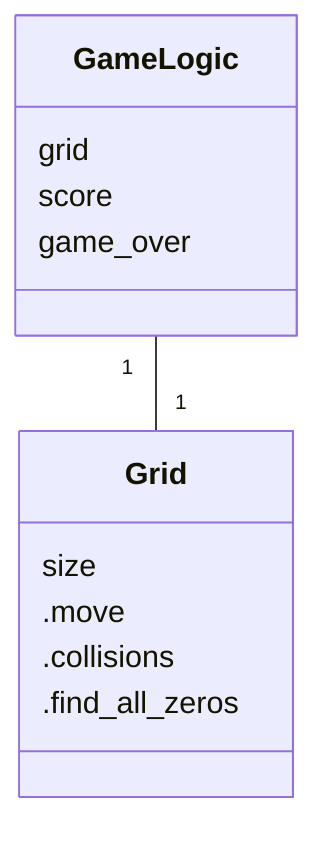

```mermaid
    classDiagram
    GameLogic "1" -- "1" Grid
    class GameLogic {
        grid
        score
        game_over
    }
    class Grid {
        size
        .move
        .collisions
        .find_all_zeros
    }
```