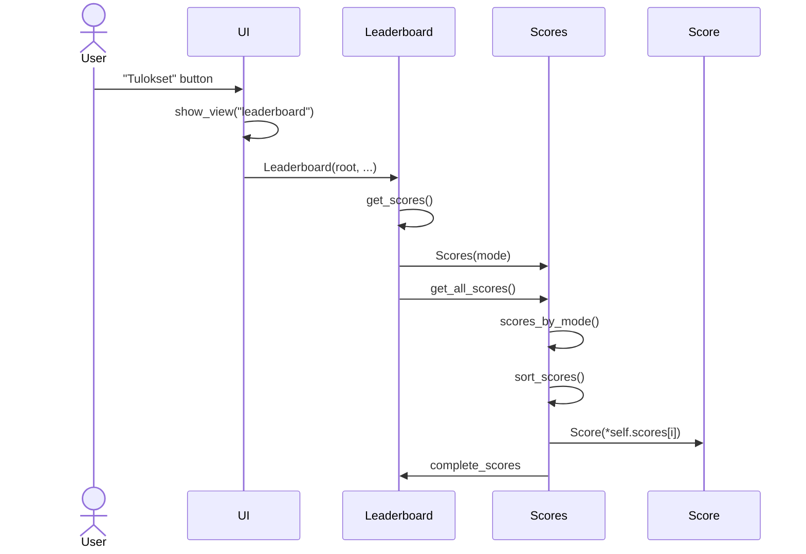
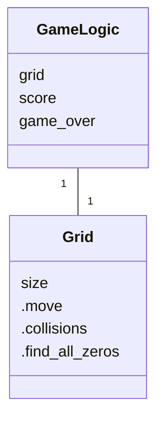

# Arkkitehtuuri

## Tulokset-näkymä

Alla oleva sekvenssikaavio kuvaa kuinka käyttäjän napin painalluksesta tallennetut tulokset päätyvät tietokannasta käyttäjälle.

## Luokkakaavio

Luokkakaavio kuvaa sovelluksen kahden keskeisen luokan yhteyttä.

