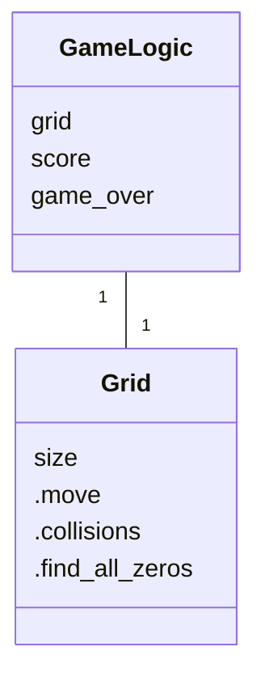
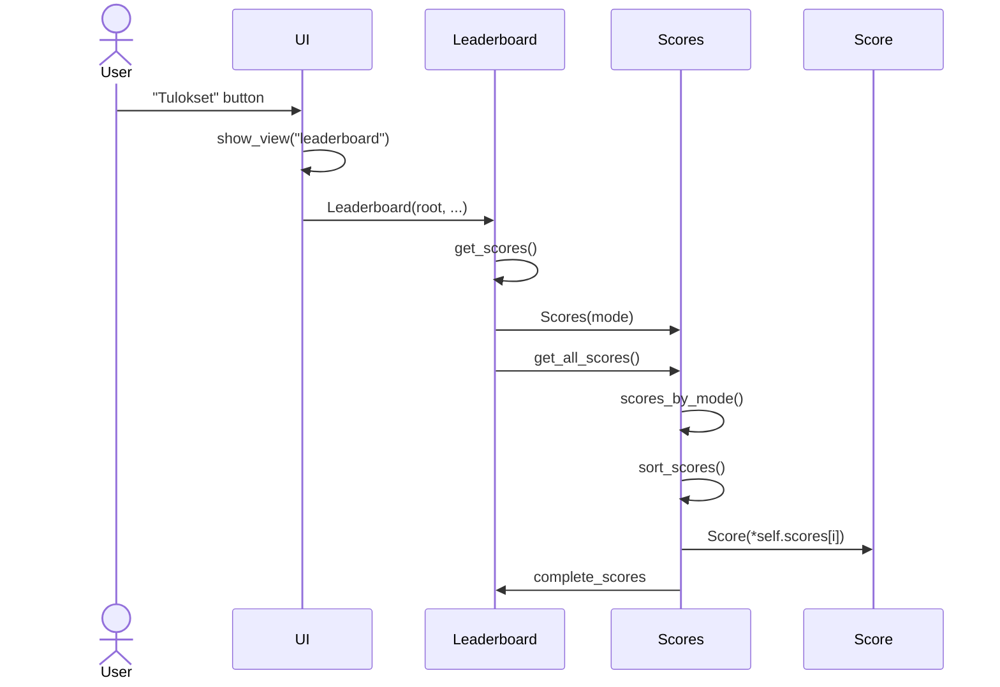

# Arkkitehtuurikuvaus

## Rakenne

Sovelluksen rakenne koostuu käyttöliittymää, sovelluslogiikaa ja tietokantaoperaatioita toteuttavista komponenteista. 

## Sovelluslogiikka

Pelin sovelluslogiikan toteuttamisesta vastaavat luokka GameLogic ja pelin ruudukon luokka Grid. 

Alla oleva luokkakaavio kuvaa näitä kahta luokkaa.

## Käyttöliittymä

Sovelluksen käyttöliittymän toteuttavat luokka UI ja eri näkymistä vastaavat luokat Game, MainMenu, Leaderboard ja  LoadGame. Luokka UI on vastuussa eri näkymien hallinnoinnista. 

### Tulokset-näkymä

Alla oleva sekvenssikaavio kuvaa kuinka käyttäjän napin painalluksesta tallennetut tulokset päätyvät tietokannasta käyttäjälle

Luokka UI siis vaihtaa näkymän Leaderboard luokan toteuttamaan näkymään. Leaderboard sitten käyttää tietokantaoperaatioita toteuttavaa Scores luokkaa apunaan hakemaan tulokset näkymään.

## Tietokantaoperaatioita toteuttavat luokat

Sovelluksessa pelien ja tulosten tallennusta toteuttavat luokat Games ja Game, sekä Scores ja Score. Game ja Score ovat yksittäisiä tietokantaolioita, joita käyttöliittymän ja sovelluslogiikan on helppo käsitellä. Luokat Games ja Scores mahdollistavat näiden olioiden hakemista tietokannasta.
