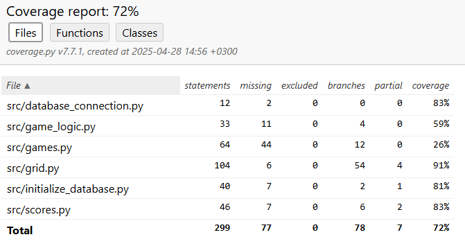

# Testausdokumentti

Sovellukselle on tehty automatisoitua yksikkötestausta pelilogiikalle sekä osalle tietokantaoperaatioista. Tämän lisäksi sovellusta on testattu manuaalisesti.

## Yksikkötestaus

### Pelilogiikka

Pelin logiikalle yksikkötestejä on tehty TestGame luokassa. Testeissä käytetään numpyn random seediä, jotta varmistutaan siitä, että testit toimivat aina samalla tavalla. Pelilogiikan yksikkötesteihin kuuluvat pelin ruudukon liikkuminen eri suuntiin ja pelin jatkaminen jo tallennetulla pelillä. Näistä ensimmäiset testaavat myös sitä, että ruudukkoon lisätty pala lisätään oikein.

### Tietokantaoperaatiot

Tietokantaoperaatioiden testaaminen tapahtuu TestScores luokassa. Tietokantaoperaatioiden testit suoritetaan siten, että APP_ENV ympäristömuuttujaan on asetettu arvo "test". Ympäristömuuttujat ovat asetettu invoke-skripteissä valmiiksi, joten tätä ei tarvitse huomioida invoken kautta testejä ajaessa. Tämä siis mahdollistaa sen, että testeille on oma tietokantansa. Testejä tietokantaoperaatioille on uuden tuloksen lisäys.

### Testauskattavuus

Sovelluksen testauskattavuudesta on jätetty pois ulkoasun toteuttavat komponentit.

## Muu testaus

Sovelluksen toiminnallisuutta on testattu myös manuaalisesti. Tähän kuuluu muun muassa tuloksen tallennuksen virheviestit väärän pituisilla nimillä ja pelin virhetilanteet poislukien hyvin isot palojen numeroarvot, joihin peli kaatuu, jos pelaaja jaksaa 5x5 ruudukolla niin kauan pelata.