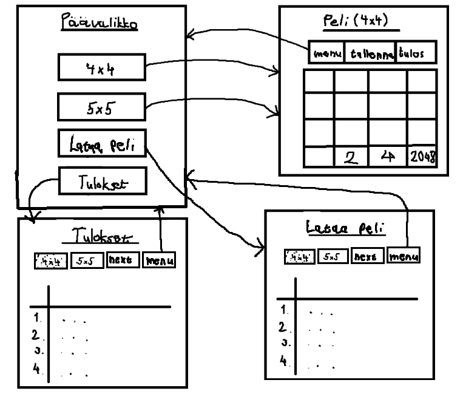

# Vaatimusmäärittely

Sovelluksessa käyttäjä pystyy pelaamaan 2048 peliä ja pitämään kirjaa parhaista tuloksistaan. Peliä pystyy pelaamaan eri kokoisilla ruudukoilla.

## Käyttöliittymäluonnos

Sovellus koostuu neljästä eri päänäkymästä; päävalikko, peli, tulokset ja pelin latausnäkymä.

Päävalikosta käyttäjä pystyy valita pelin eri kokoisilla ruudukoilla, tulokset näkymän tai pelin latausnäkymän. Pelin päätyttyä pelinäkymään tulee ilmoitus pelin päättymisestä ja tuloksen tallennusmahdollisuudesta.

## Sovelluksen toiminnallisuus

- [x] Käyttäjä pystyy valitsemaan päävalikosta pelin eri kokoisilla ruudukoilla
    * [x] Käyttäjä pystyy pelata nuolinäppäimillä
    * [x] Eri ruudukon kokoja
    * [x] Pelissä pisteet määräytyy yhdistettyjen palikoiden perusteella
    * [x] Tuloksen voi tallentaa pelin päätyttyä yhdistettynä ruudukon kokoon
- [x] Käyttäjä pystyy tarkastelemaan aikaisempia pelien tuloksiaan tulokset sivulla
    * [x] Ryhmitelty eri ruudukon kokojen perusteella
    * [x] Lajiteltu parhaan tuloksen mukaan
    * [x] Tuloksessa mukana nimimerkki
- [x] Pelin päätyttyä käyttäjä voi valita pelata uudestaan tai mennä päävalikkoon
- [x] Pelin voi tallentaa ja jatkaa myöhemmin

## Jatkokehitysideoita 

- Pelin ulkoasun personointi (ruudukon väri yms.)
