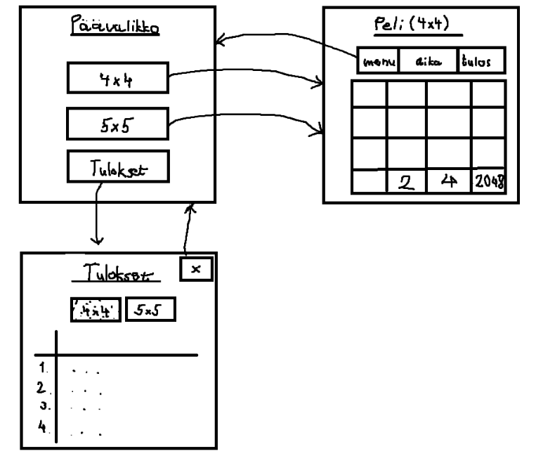

# Vaatimusmäärittely

## Yleistä

Sovelluksessa käyttäjä pystyy pelaamaan 2048 peliä ja pitämään kirjaa parhaista tuloksistaan. Peliä pystyy pelaamaan eri kokoisilla ruudukoilla.

## Käyttöliittymäluonnos

Sovellus koostuu kolmesta eri päänäkymästä; päävalikko, peli ja tulokset.

Päävalikosta käyttäjä pystyy valita pelin eri kokoisilla ruudukoilla tai tulokset näkymän. Pelin päätyttyä pelinäkymään tulee ilmoitus pelin päättymisestä ja valikko vaihtoehdoista (päävalikkoon, uusi peli, tulokset).

## Sovelluksen toiminnallisuus

- [ ] Käyttäjä pystyy valitsemaan päävalikosta pelin eri kokoisilla ruudukoilla
    * [x] Käyttäjä pystyy pelata nuolinäppäimillä
    * [ ] Eri ruudukon kokoja
    * [x] Pelissä pisteet määräytyy yhdistettyjen palikoiden perusteella
    * [x] Tulos tallentuu pelin päätyttyä yhdistettynä ruudukon kokoon
- [x] Käyttäjä pystyy tarkastelemaan aikaisempia pelien tuloksiaan tulokset sivulla
    * [x] Ryhmitelty eri ruudukon kokojen perusteella
    * [x] Lajiteltu parhaan tuloksen mukaan
    * [x] Tuloksessa mukana nimimerkki
- [x] Pelin päätyttyä käyttäjä voi valita pelata uudestaan tai mennä päävalikkoon

## Jatkokehitysideoita 

- Pelin ulkoasun personointi (ruudukon väri yms.)
- Pelin voi tallentaa ja jatkaa myöhemmin
- Julkisessa internetissä oleva api tarjoaa tulokset, jotka sovellus hakee ja näyttää käynnistäessä paikallisesti
    * Tulokset myös talletettaisiin verkon yli ja käyttäjät näkisivät muiden käyttäjien jakamat tulokset
